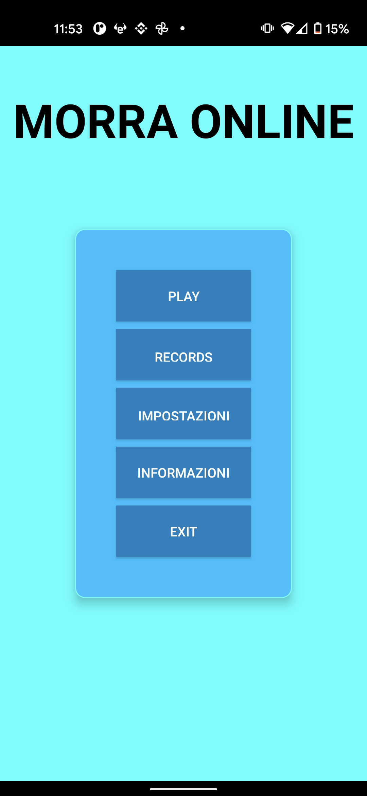
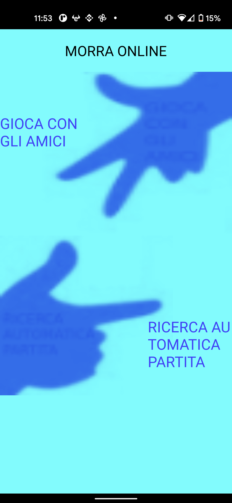
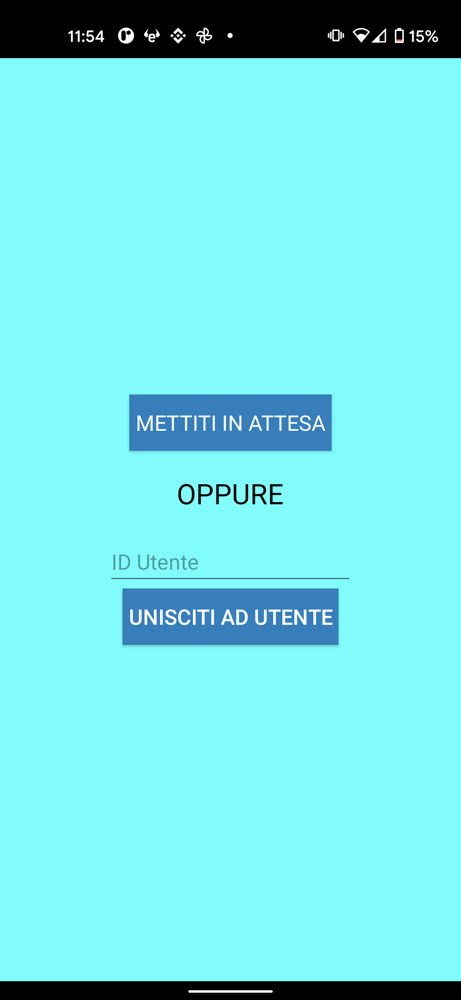
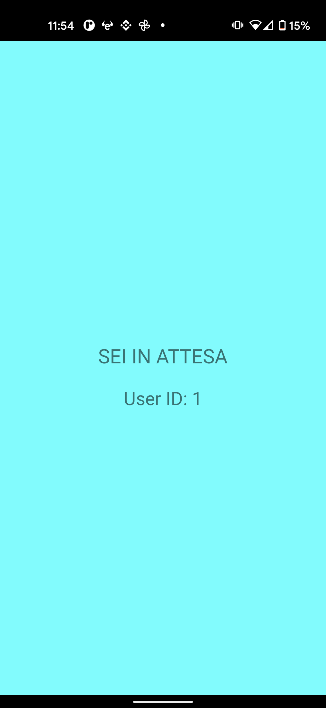
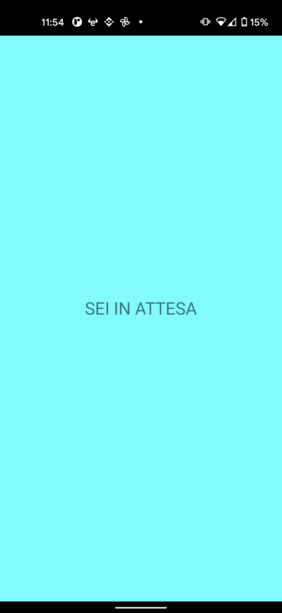
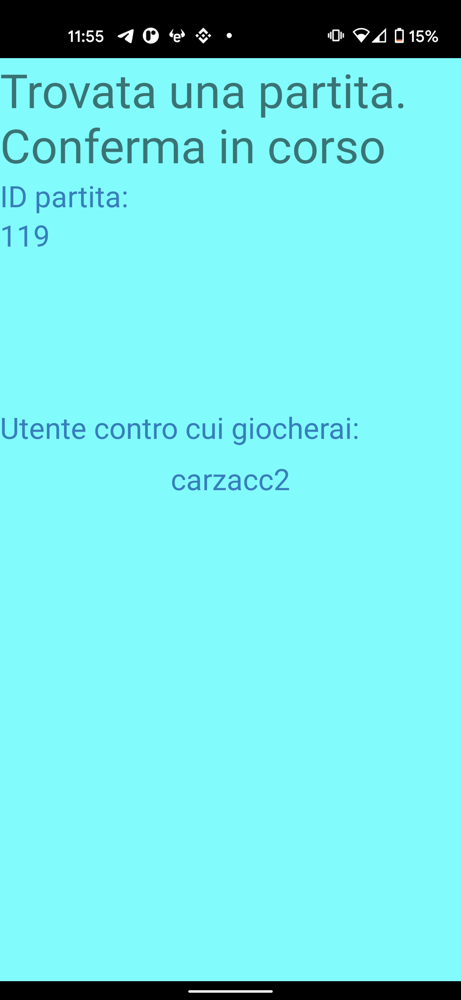
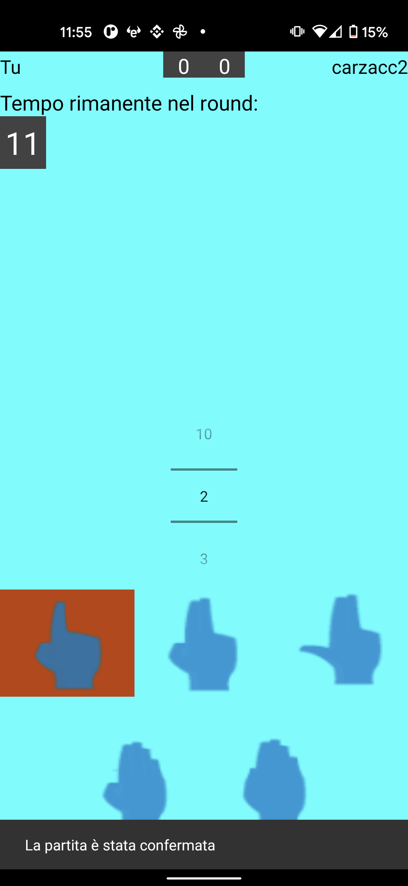
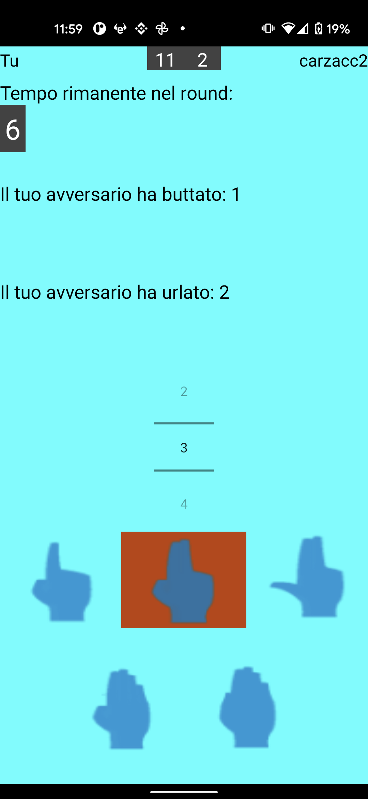
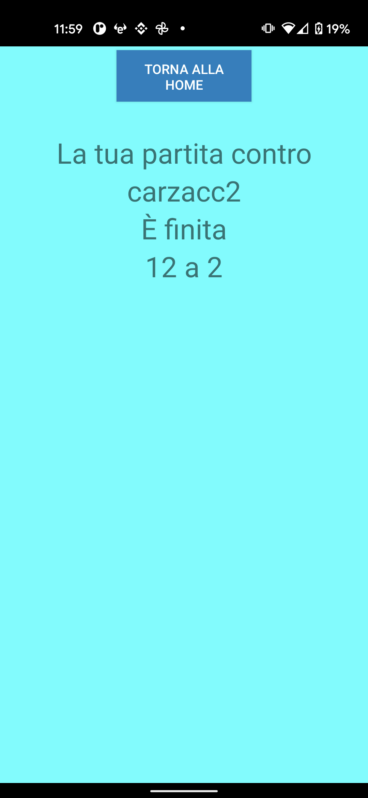

# App Android Morra online

[Documentazione Javadoc](https://biagioecarmine.github.io/morra-app-docs/)

## Screenshots

Home page

</img>

*Play* screen

</img>

*Play with friends* features

 </img></img>

Public Matchmaking

</img>

Match confirmation

</img>

Match screen

</img> </img>

Match over

</img>
